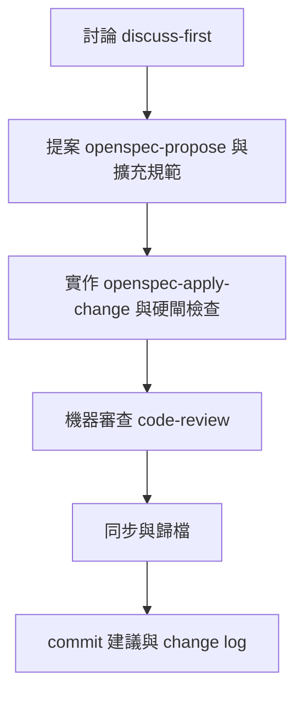

# .agents

<details>
<summary>目錄</summary>

- [關於本專案](#關於本專案)
- [技術堆疊](#技術堆疊)
- [快速開始](#快速開始)
- [專案結構](#專案結構)
- [專案邏輯](#專案邏輯)
- [Skill 一覽](#skill-一覽)

</details>

## 關於本專案

本目錄是工作區共用的 Agent 設定與技能庫，把可重用的工作流程、寫作規範與框架實務集中存放，供 Cursor、Claude 等工具以捷徑載入。核心是工廠模式：由總指揮依序調度討論、提案、實作、機器檢查與歸檔相關技能；其餘技能採選配，依當下任務手動啟用。

## 技術堆疊

| 類型 | 名稱 | 說明 |
| --- | --- | --- |
| 規格驅動流程 | [OpenSpec](https://github.com/Fission-AI/OpenSpec) | propose / apply / sync / archive 等原生技能與指令 |
| Agent 技能標準 | Agent Skills（`SKILL.md`） | 各技能以目錄＋說明檔形式安裝 |
| 編輯器整合 | Cursor / Claude | 透過初始化腳本建立指向本目錄的捷徑 |

## 快速開始

初始化步驟見 [init-agent-script/readme.md](./init-agent-script/readme.md)。依使用環境執行對應腳本一次即可。

## 專案結構

```text
.agents/
├── skills/              # 全部 Agent 技能
├── commands/            # OpenSpec 相關斜線指令
└── init-agent-script/   # 建立編輯器捷徑的腳本
```

## 專案邏輯

工廠模式由 `orchestrator-factory` 總指揮調度。僅在使用者明確啟用時進入；預設不自動開跑。



## Skill 一覽

欄位：技能名稱、作者、簡述。作者若來自公開倉庫，附上 GitHub 連結。

### Factory workflow 會載入的 skill

依工廠實際流程排序。

| 順序 | Skill | 作者 | 簡述 |
| --- | --- | --- | --- |
| 1 | `orchestrator-factory` | 自製 | 工廠模式總指揮：排程、派工、人閘、彙整執行工作區 |
| 2 | `discuss-first` | 自製 | 僅討論不改檔的開場；對齊需求與邊界 |
| 3 | `openspec-propose` | [OpenSpec](https://github.com/Fission-AI/OpenSpec) | 一次產出 change 的提案、設計與任務清單 |
| 4 | `opsx-propose-guide` | 自製 | 提案擴充規範：切分、命名、依賴與冷啟動自足 |
| 5 | `test-first` | 自製 | 測試優先；提案階段必載，實作階段繼續沿用 |
| 6 | `openspec-apply-change` | [OpenSpec](https://github.com/Fission-AI/OpenSpec) | 依 change 任務逐項實作 |
| 7 | `opsx-apply-guide` | 自製 | 實作擴充規範：清單進度、測試優先、偏離紀錄 |
| 8 | `hard-verify` | 自製 | 指揮編譯、建置、靜態檢查與單元測試等硬閘 |
| 9 | `code-review` | [Matt Pocock](https://github.com/mattpocock/skills) | 規範與規格雙軸審查；由獨立檢查工作者執行 |
| 10 | `openspec-sync-specs` | [OpenSpec](https://github.com/Fission-AI/OpenSpec) | 將變更規格同步進主規格 |
| 11 | `openspec-archive-change` | [OpenSpec](https://github.com/Fission-AI/OpenSpec) | 完成後歸檔 change |
| 12 | `commit-message-suggestion` | 自製 | 產生 commit 訊息建議，不代為提交 |
| 13 | `change-log` | 自製 | 產出改動清單，向使用者與開發者說明變更 |

### 其他選配 skill

| Skill | 作者 | 簡述 |
| --- | --- | --- |
| `openspec-explore` | [OpenSpec](https://github.com/Fission-AI/OpenSpec) | 探索模式：釐清想法，尚未開立 change |
| `impl-verify` | 自製 | 需求邊界檢查；可獨立使用，非工廠主路徑 |
| `playwright-cli` | [Microsoft](https://github.com/microsoft/playwright-cli) | 瀏覽器命令列自動化；`impl-verify` 依賴項 |
| `karpathy-guidelines` | [forrestchang/andrej-karpathy-skills](https://github.com/forrestchang/andrej-karpathy-skills) | 實作行為準則：先想清楚、簡化、外科手術式改動 |
| `ponytail` | [DietrichGebert](https://github.com/DietrichGebert/ponytail) | 懶惰資深工程師模式：選最簡可行解 |
| `opsx-health-check` | 自製 | 主規格與程式落差的健康檢查，匯出比對報告 |
| `code-to-docs` | 自製 | 依程式與主規格產出人類可讀文件 |
| `thought-palette-extract` | 自製 | 收斂決策為可匯入圖像化工具的結構化資料 |
| `create-skill-guide` | 自製 | 撰寫或更新技能檔頭 metadata 的規範 |
| `doc-general-guide` | 自製 | 文件寫作基礎規範層 |
| `doc-readme-guide` | 自製 | 私有／小團隊 README；依賴 `doc-general-guide` |
| `doc-sop-guide` | 自製 | 開發者操作與部署說明；依賴 `doc-general-guide` |
| `doc-user-guide` | 自製 | 使用者畫面操作手冊；依賴 `doc-general-guide` |
| `grill-me` | [Matt Pocock](https://github.com/mattpocock/skills) | 以連續拷問對齊計畫與設計 |
| `grill-with-docs` | [Matt Pocock](https://github.com/mattpocock/skills) | 拷問並同步產出決策紀錄與詞彙表 |
| `grilling` | [Matt Pocock](https://github.com/mattpocock/skills) | grill 系列底層可複用迴圈 |
| `codebase-design` | [Matt Pocock](https://github.com/mattpocock/skills) | 深度模組設計的共用詞彙與紀律 |
| `domain-modeling` | [Matt Pocock](https://github.com/mattpocock/skills) | 打磨專案領域模型與共用語言 |
| `diagnosing-bugs` | [Matt Pocock](https://github.com/mattpocock/skills) | 難除缺陷與效能回歸的診斷迴圈 |
| `improve-codebase-architecture` | [Matt Pocock](https://github.com/mattpocock/skills) | 掃描架構加深機會，再以拷問收斂 |
| `prototype` | [Matt Pocock](https://github.com/mattpocock/skills) | 用拋棄式原型回答設計問題 |
| `research` | [Matt Pocock](https://github.com/mattpocock/skills) | 依高信任來源調查並寫成 Markdown |
| `resolving-merge-conflicts` | [Matt Pocock](https://github.com/mattpocock/skills) | 進行中的合併或變基衝突逐塊解決 |
| `triage` | [Matt Pocock](https://github.com/mattpocock/skills) | 議題與外部合併請求的分流狀態機 |
| `wayfinder` | [Matt Pocock](https://github.com/mattpocock/skills) | 超長程工作的決策票地圖 |
| `handoff` | [Matt Pocock](https://github.com/mattpocock/skills) | 壓縮對話成交接文件給下一代理 |
| `teach` | [Matt Pocock](https://github.com/mattpocock/skills) | 以工作區為狀態的多回合教學 |
| `writing-great-skills` | [Matt Pocock](https://github.com/mattpocock/skills) | 編寫與編輯技能的詞彙與原則 |
| `vue-best-practices` | [vuejs-ai](https://github.com/vuejs-ai/skills) | Vue 3 Composition API 與 TypeScript 實務 |
| `vue-pinia-best-practices` | [vuejs-ai](https://github.com/vuejs-ai/skills) | Pinia 狀態管理與反應性模式 |
| `vue-router-best-practices` | [vuejs-ai](https://github.com/vuejs-ai/skills) | Vue Router 導航守衛與生命週期 |
| `vue-testing-best-practices` | [vuejs-ai](https://github.com/vuejs-ai/skills) | Vitest、元件測試與端對端測試實務 |
| `regle` | [Victor Garcia](https://github.com/victorgarciaesgi/regle) | Regle 表單驗證核心 |
| `regle-rules` | [Victor Garcia](https://github.com/victorgarciaesgi/regle) | 內建與自訂驗證規則 |
| `regle-advanced` | [Victor Garcia](https://github.com/victorgarciaesgi/regle) | 集合、非同步與跨元件等進階模式 |
| `regle-schemas` | [Victor Garcia](https://github.com/victorgarciaesgi/regle) | 與 Zod、Valibot 等 schema 庫整合 |
| `regle-typescript` | [Victor Garcia](https://github.com/victorgarciaesgi/regle) | Regle 的 TypeScript 型別整合 |
| `regle-migrate-vuelidate` | [Victor Garcia](https://github.com/victorgarciaesgi/regle) | 自 Vuelidate 遷移至 Regle |
| `java-coding-style` | 自製 | UITC Java 後端編碼規範 |
