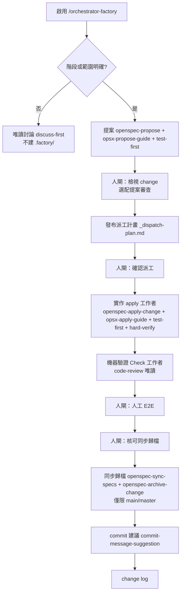
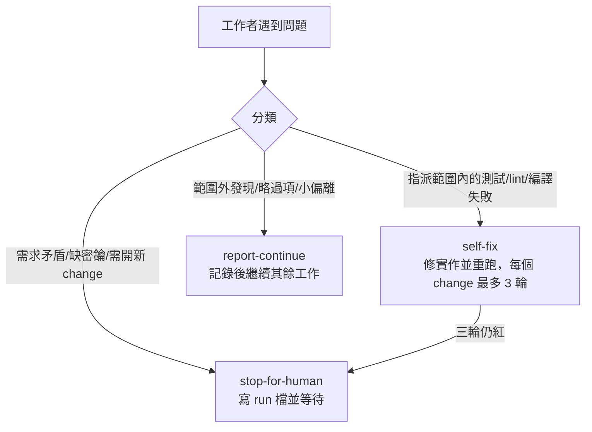

# orchestrator-factory

<details>
<summary>目錄</summary>

- [關於本技能](#關於本技能)
- [如何啟用](#如何啟用)
- [工作區結構](#工作區結構)
- [技能邏輯](#技能邏輯)
- [關鍵參數](#關鍵參數)

</details>

## 關於本技能

`orchestrator-factory` 是工廠模式的「廠長」總指揮。它把 OpenSpec 的一整條開發流程串起來——討論、提案、實作、機器驗證、人工 E2E、同步歸檔、commit 建議、change log——並把每個階段派給具名的工作者去做，自己只負責排程、守人閘、彙整回報，然後為使用者停下。

它只在使用者明確啟用時進入，預設不自動開跑；遇到不明確的指令會退回唯讀討論。三條核心紀律貫穿全程：**驗證分離**（實作者只做硬閘檢查，程式審查一律另派工作者）、**絕不代為 commit**、**不臆造需求**。流程中會依階段載入相依子技能：`discuss-first`、`openspec-propose`／`opsx-propose-guide`、`test-first`、`openspec-apply-change`／`opsx-apply-guide`、`hard-verify`、`code-review`、`openspec-sync-specs`／`openspec-archive-change`、`commit-message-suggestion`、`change-log`；提案審查（`change-review-request`／`change-review-response`）為選配。

## 如何啟用

以斜線指令明確啟用，不會自動觸發：

```text
/orchestrator-factory
```

啟用後的動作：

1. 宣告工廠模式已開啟。
2. 解析當前指令的起始階段、結束階段、change 名稱或系列、選配技能、模型偏好，以及要恢復的既有 `run_dir`。
3. 若階段或範圍不明確，退回**唯讀討論**：不建立 `.factory/`、不提案、不派工，直到使用者指示。
4. 若為恢復既有 run，先讀該 run 的 `_status.md`、`_dispatch-plan.md` 與最新產物再行動。

## 工作區結構

離開討論、進入提案或之後的階段時，總指揮才建立一個 run 目錄；純唯讀討論不建立。

```text
.factory/<YYYY-MM-DD>-<slug>/
├── _status.md              # 階段、分支、工作者、阻塞點與最新產物指標
├── _dispatch-plan.md       # 具名工作者派工表，等待或已確認
├── _memory.md              # 跨工作者共享事實：決策、路徑、fixed_point
├── _needs-input.md         # 遇 needs_input 時的原因與四選單（選用）
├── apply-w1-result.md      # 實作工作者的結構化結果
├── hard-verify-w1.md       # 該實作工作者的硬閘檢查證據
├── check-<change-id>-code-review.md   # Check 工作者的程式審查報告
└── change-review-request-NN.md        # 選配的提案審查邀請與裁決（成對 NN）
```

- `slug` 只用小寫英數與連字號；同一天不同主題須用不同 slug，路徑須唯一。
- 只有總指揮建立 run 目錄；工作者不得另建。
- 這裡放編排狀態與工作者產物，**不放**產品原始碼，也**不**取代 `openspec/**` 的規格與 change 套件。

## 技能邏輯

### 完整流程

每個人閘都必須停下等待使用者，綠燈的檢查不等於可以出貨。



### 修復政策

工作者遇到問題時先分類，不是一律標記阻塞。



## 關鍵參數

### 修復層級

| 層級 | 觸發 | 行為 |
| --- | --- | --- |
| self-fix | 指派範圍內的單元測試／lint／編譯失敗 | 修復實作並重跑檢查，每個 change 最多 3 輪；不得靠刪除或弱化測試蒙混過關 |
| report-continue | 範圍外發現、略過的檢查類別、已記於 `tasks.md` 的小偏離 | 寫入結果或 `_memory.md`，繼續該工作者其餘指派 |
| stop-for-human | 需求矛盾、缺密鑰或環境、設計無法實作、self-fix 三輪仍紅、需開新 change、`needs_input` | 標記 `blocked`／`needs_input`，寫 run 檔並等待 |

### `needs_input` 四選單

工作者回報 `needs_input` 時，總指揮寫入 `_needs-input.md` 並提供編號選項，讓使用者可直接回覆選號。

| 選項 | 意義 |
| --- | --- |
| 1 補定義 | 由人在討論或 change 文件補上缺漏的邊界 |
| 2 由 repo／env 解 | 允許唯讀查找後恢復 |
| 3 佔位樣板 | 僅在使用者明確選此項後才建臨時 stub |
| 4 略過此項 | 延後處理，不宣稱已完成 |

### 工作區檔案慣例

| 類型 | 命名 | 誰寫 | 用途 |
| --- | --- | --- | --- |
| 控制／交接 | `_*.md` | 總指揮 | 控制面與暫時交接 |
| 工作者產物 | `<role>-<id>-*.md` | 該工作者 | 結構化結果 |

同步歸檔僅能在 `main`／`master` 分支執行；在功能分支上會被擋下並警告，以免破壞主規格檔。
