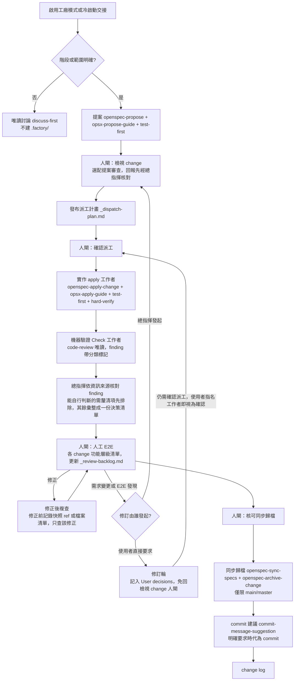
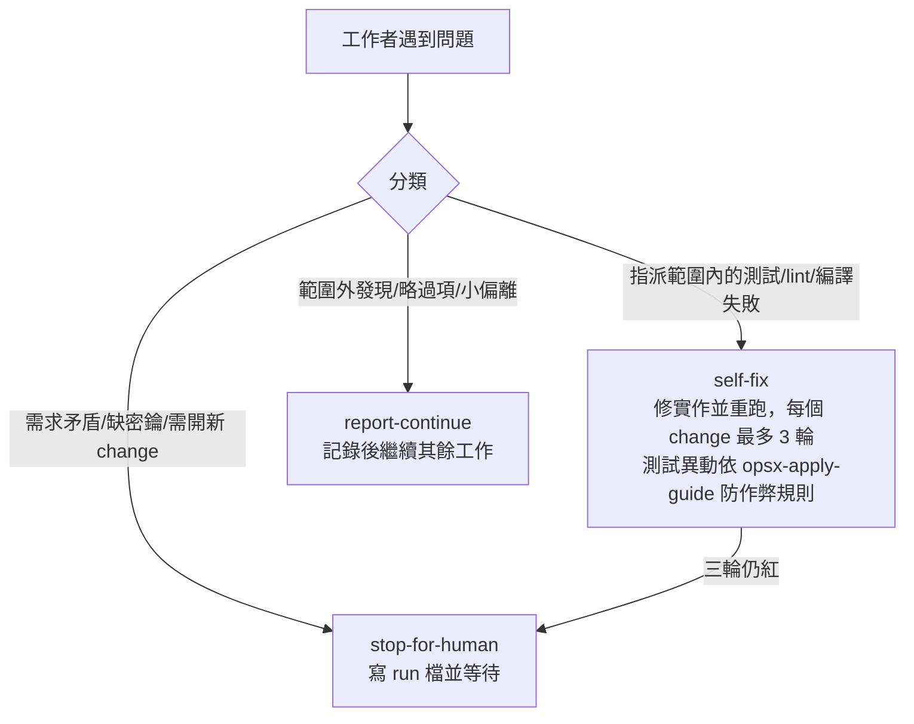

# orchestrator-factory

<details>
<summary>目錄</summary>

- [關於本技能](#關於本技能)
- [如何啟用](#如何啟用)
- [工作區結構](#工作區結構)
- [技能邏輯](#技能邏輯)
- [關鍵參數](#關鍵參數)

</details>

## 關於本技能

`orchestrator-factory` 是工廠模式的「廠長」總指揮。它把 OpenSpec 的一整條開發流程串起來——討論、提案、實作、機器驗證、人工 E2E、同步歸檔、commit 建議、change log——並把每個階段派給具名的工作者去做，自己只負責排程、守人閘、彙整回報，然後為使用者停下。

它只在使用者表明要用工廠模式，或被指派到等待工廠接手的既有 run 時進入；遇到不明確的指令會退回唯讀討論。三條核心紀律貫穿全程：**驗證分離**（實作者只做硬閘檢查，程式審查一律另派工作者）、**預設不代為 commit**（使用者明確要求時才依 `commit-message-suggestion` 的做法代為 commit，工作者永不 commit）、**不臆造需求**。資訊不足時依資訊來源優先序查閱：使用者提出或確認的資訊、`.manager` 正典檔與 opsx 主規格及專案 docs、run 內未確認的筆記、opsx change；`.manager` 只可唯讀查閱，不得寫入。流程中會依階段載入相依子技能：`discuss-first`、`openspec-propose`／`opsx-propose-guide`、`test-first`、`openspec-apply-change`／`opsx-apply-guide`、`hard-verify`、`code-review`、`openspec-sync-specs`／`openspec-archive-change`、`commit-message-suggestion`、`change-log`；提案審查（`change-review-request`／`change-review-response`）與多 agent 協作（`peer-agent-coordination`）為選配。

## 如何啟用

有兩條啟用路徑：

- 使用者以斜線指令、「工廠模式」或同義說法表明要用工廠模式。
- 冷啟動交接：新 session 被指派到某個既有 `.factory/_runs/<run>/`，且其 `_status.md` 為 `Stage: await-factory-session`、`Factory started: no`。此時直接沿用該 run，先讀 `_status.md`、`_intake.md`、`_memory.md`，不需使用者再下啟用指令。

```text
/orchestrator-factory
```

只因 `.factory/` 存在、有舊 run，或對話中提到工廠，不會啟用。啟用本身不代表核可派工、實作、E2E 驗收或同步歸檔，各人閘照常適用。

啟用後的動作：

1. 宣告工廠模式已開啟。
2. 判斷是使用者啟用、冷啟動交接或恢復既有 run，並確認 `run_dir`。
3. 讀該 run 的 `_status.md` 與相關控制檔、最新產物再行動；需要時可依資訊來源優先序唯讀查閱 `.manager`，`.manager` 不存在也不影響啟用。
4. 判斷工作屬於專案實作或非專案實作：專案實作走完整 opsx 流程；研究、盤點、純文件等非專案工作改走量身路線，不強制建立 OpenSpec 產物，但仍須說明產物、允許寫入範圍、驗證方式與人閘。
5. 若階段、產物、範圍或路線不明確，退回**唯讀討論**：不建立 `.factory/`、不提案、不派工，直到使用者指示。

## 工作區結構

離開討論、進入提案或之後的階段時，總指揮才建立一個 run 目錄；純唯讀討論不建立。

```text
.factory/
├── .gitignore              # 單行：_runs/，建立第一個 run 時初始化
├── _review-backlog.md      # 跨 run 累積的人工驗收清單，只由總指揮維護
└── _runs/<YYYY-MM-DD>-<slug>/
    ├── _intake.md              # PM 交接建立的冷啟動起始檔，與 _status.md、_memory.md 一併建立（選用）
    ├── _status.md              # 階段、分支、工作者、Blockers／Decisions needed／Reminders、修訂輪次與最新產物指標
    ├── _dispatch-plan.md       # 具名工作者派工表，等待或已確認
    ├── _memory.md              # 跨工作者共享事實：決策、路徑、fixed_point；使用者定案放 User decisions 區
    ├── _notes.md               # 未經使用者確認的討論筆記與 .manager 訂正（選用）
    ├── _needs-input.md         # 遇 needs_input 時的原因與四選單（選用）
    ├── _handoff-<worker>.md    # 工廠內部給單一工作者的暫存交接（選用）
    ├── handoff-<recipient>-<topic>.md     # 給 run 以外對象的交接，例如 handoff-manager-<topic>.md
    ├── apply-w1-result.md      # 實作工作者的結構化結果
    ├── hard-verify-w1.md       # 該實作工作者的硬閘檢查證據
    ├── check-<change-id>-code-review.md   # Check 工作者的程式審查報告
    ├── change-review-request-NN.md        # 選配的提案審查邀請
    └── change-review-response-NN.md       # 審查者的裁決，與邀請同一個 NN
```

- `slug` 只用小寫英數與連字號；同一天不同主題須用不同 slug，路徑須唯一。
- 只有總指揮建立 run 目錄；工作者不得另建，也不得寫入 `_review-backlog.md`。冷啟動交接的 run 由 PM 交接建立。
- 底線開頭的檔由總指揮寫；工作者只有在派工指示允許時才可追加。
- `.factory/` 根目錄只放 `.gitignore`、`_review-backlog.md` 與 `_runs/`。run 是討論與編排的工作區，內容繁雜不進版控，收斂結果由 opsx 管理。
- `_handoff-<worker>.md` 只用於工廠內部；給其他對象的交接用 `handoff-<recipient>-<topic>.md`，放寄件方 run 根目錄，檔頭三行為 `Source run:`、`Recipient:`、`Date:`，收件方處理後記在自己的 run，不回寫寄件方。
- `_status.md`、`_memory.md`、`_dispatch-plan.md`、`_review-backlog.md` 以編輯工具原地更新；確實需要追加時先檢查有無重複內容。
- 這裡放編排狀態與工作者產物，**不放**產品原始碼，也**不**取代 `openspec/**` 的規格與 change 套件。

## 技能邏輯

### 完整流程

每個人閘都必須停下等待使用者，綠燈的檢查不等於可以出貨。


```mermaid
flowchart TD
  A[啟用工廠模式或冷啟動交接] --> B{階段或範圍明確?}
  B -- 否 --> D[唯讀討論 discuss-first<br/>不建 .factory/]
  B -- 是 --> P[提案 openspec-propose + opsx-propose-guide + test-first]
  P --> G1[人閘：檢視 change<br/>選配提案審查，回報先經總指揮核對]
  G1 --> DP[發布派工計畫 _dispatch-plan.md]
  DP --> G2[人閘：確認派工]
  G2 --> AP[實作 apply 工作者<br/>openspec-apply-change + opsx-apply-guide + test-first + hard-verify]
  AP --> CK[機器驗證 Check 工作者<br/>code-review 唯讀，finding 帶分類標記]
  CK --> VC[總指揮依資訊來源核對 finding<br/>能自行判斷的需釐清項先排除，其餘彙整成一份決策清單]
  VC --> G3[人閘：人工 E2E<br/>各 change 功能層級清單，更新 _review-backlog.md]
  G3 -- 修正 --> RC[修正後複查<br/>修正前記錄快照 ref 或檔案清單，只查該修正]
  RC --> G3
  G3 -- 需求變更或 E2E 發現 --> AR{修訂由誰發起?}
  AR -- 使用者直接要求 --> AU[修訂輪<br/>記入 User decisions，免回檢視 change 人閘]
  AU -- 仍需確認派工，使用者指名工作者即視為確認 --> G2
  AR -- 總指揮發起 --> G1
  G3 --> G4[人閘：核可同步歸檔]
  G4 --> SY[同步歸檔 openspec-sync-specs + openspec-archive-change<br/>僅限 main/master]
  SY --> CM[commit 建議 commit-message-suggestion<br/>明確要求時代為 commit]
  CM --> CL[change log]
```

### 其他規則

- **討論期間不改專案檔**：討論、協助部署或撰寫文件時，總指揮不修改專案檔、設定檔或進入點程式；需要改程式時說明原因並詢問是否開 propose。使用者口頭授權的修改例外，有 run 時記入 `_memory.md` 的 User decisions 區。
- **文件同步**：預設只同步受這次工作影響的 README。使用者提到其他文件，例如 docs 資料夾、`.manager` 檔、巢狀 README、說明文件、交接檔時，先列出會同步的文件清單等使用者確認，不得擅自更新；`.manager` 仍只透過交接檔處理。各類文件依對應的 doc 系列技能撰寫。
- **需使用者釐清的項目**：提案審查或 Check 回報需釐清的項目時，總指揮先依資訊來源優先序自行判斷並排除，真的無法判斷的才交給使用者，並彙整成一份決策清單，不逐條轉述。
- **工作者模型與執行環境**：工作者預設與總指揮同模型，換模型須先徵得使用者同意；優先使用平行工作者或 subagent，環境無法隔離時改為產出可貼上的各工作者指令並等待。
- **多 agent 協作**：`peer-agent-coordination` 成本高，不主動啟用，使用者提及或協作討論需要時才用；不因 run 結構、其他技能的引用或工作者數量而啟用。

### 修復政策

工作者遇到問題時先分類，不是一律標記阻塞。


```mermaid
flowchart TD
  X[工作者遇到問題] --> C{分類}
  C -- 指派範圍內的測試/lint/編譯失敗 --> S[self-fix<br/>修實作並重跑，每個 change 最多 3 輪<br/>測試異動依 opsx-apply-guide 防作弊規則]
  C -- 範圍外發現/略過項/小偏離 --> R[report-continue<br/>記錄後繼續其餘工作]
  C -- 需求矛盾/缺密鑰/需開新 change --> H[stop-for-human<br/>寫 run 檔並等待]
  S -- 三輪仍紅 --> H
```

## 關鍵參數

### 修復層級

| 層級 | 觸發 | 行為 |
| --- | --- | --- |
| self-fix | 指派範圍內的單元測試／lint／編譯失敗 | 修復實作並重跑檢查，每個 change 最多 3 輪；測試異動依 `opsx-apply-guide` 的防作弊規則 |
| report-continue | 範圍外發現、略過的檢查類別、已記於 `tasks.md` 的小偏離 | 寫入結果或 `_memory.md`，繼續該工作者其餘指派 |
| stop-for-human | 需求矛盾、缺密鑰或環境、設計無法實作、self-fix 三輪仍紅、需開新 change、`needs_input` | 標記 `blocked`／`needs_input`，寫 run 檔並等待 |

使用者確認派工即視為授權實作工作者在每個 change 結束前執行 `hard-verify`，覆寫該技能「只在使用者明確呼叫時執行」的預設；Check 工作者不執行 `hard-verify`。

### `needs_input` 四選單

工作者回報 `needs_input` 時，總指揮先查 run 內定案、`.manager`、docs 等紀錄；已有答案就依紀錄恢復並說明依據。沒有答案才寫入 `_needs-input.md` 並提供編號選項，讓使用者可直接回覆選號。

| 選項 | 意義 |
| --- | --- |
| 1 補定義 | 由人在討論或 change 文件補上缺漏的邊界 |
| 2 由 repo／env 解 | 允許唯讀查找後恢復 |
| 3 佔位樣板 | 僅在使用者明確選此項後才建臨時 stub |
| 4 略過此項 | 延後處理，不宣稱已完成 |

### 工作區檔案慣例

| 類型 | 命名 | 誰寫 | 用途 |
| --- | --- | --- | --- |
| 控制／交接 | `_*.md` | 總指揮；工作者僅在派工指示允許時追加 | 控制面與工廠內部暫時交接 |
| 工作者產物 | `<role>-<id>-*.md` | 該工作者 | 結構化結果 |
| 跨對象交接 | `handoff-<recipient>-<topic>.md` | 總指揮 | 交給 run 以外的對象 |

同步歸檔僅能在 `main`／`master` 分支執行；在功能分支上會被擋下並警告，以免破壞主規格檔。人工驗證項目未勾選時，使用者口頭確認即可歸檔，總指揮記入 run，但不代為勾選。
