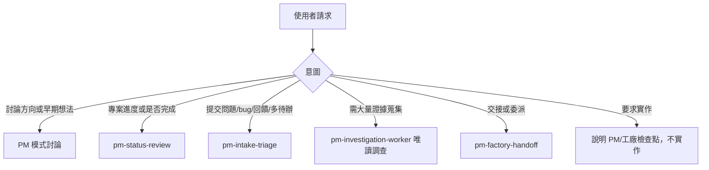
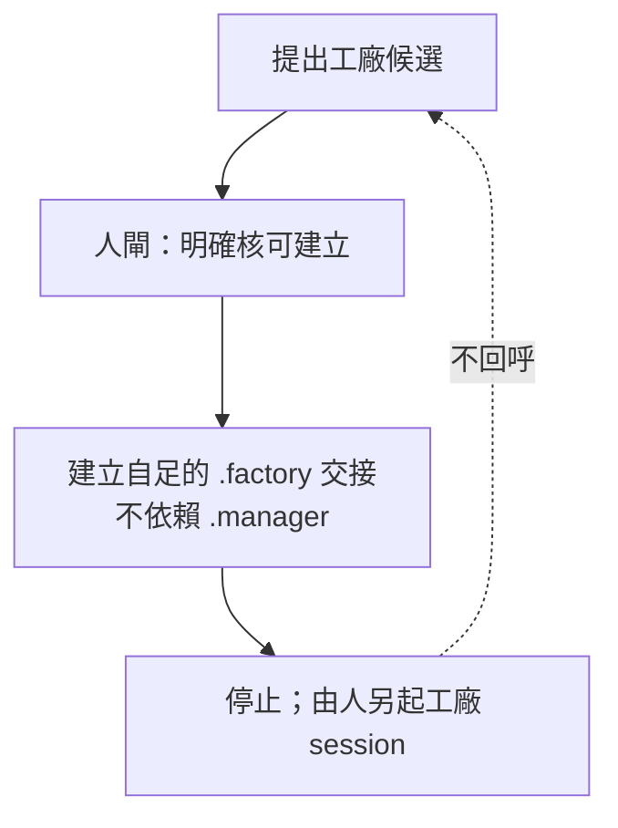

# orchestrator-pm

<details>
<summary>目錄</summary>

- [關於本技能](#關於本技能)
- [如何啟用](#如何啟用)
- [工作區結構](#工作區結構)
- [技能邏輯](#技能邏輯)
- [關鍵參數](#關鍵參數)

</details>

## 關於本技能

`orchestrator-pm` 是專案的控制面 PM。它維持專案的長期方向與狀態、協調有界的調查、整理事實與決策，並在人工核可後準備交接給工廠，但自己不成為實作者。

它只寫 `.manager/**`（唯一例外是人工核可的工廠交接），不碰產品原始碼、規格或部署狀態，也不啟動工廠。PM 與工廠之間保留人工檢查點：PM 只提出候選並準備交接，由人另起獨立的工廠 session，工廠不回呼 PM；等人再次啟動 PM 並要求盤點時，才對進度做核對。流程中依主題載入相依子技能：`pm-status-review`（狀態盤點）、`pm-intake-triage`（進件分流）、`pm-investigation-worker`（唯讀調查）、`pm-factory-handoff`（工廠交接）。

## 如何啟用

以斜線指令明確啟用，不會從一般專案問題自動進入：

```text
/orchestrator-pm
```

啟用後的動作：

1. 宣告 PM 模式與這次的目標。
2. 唯讀檢視 `.manager/`。
3. 若 `.manager/` 不存在，先判斷工作區是否已有可觀的專案狀態：
   - **已有狀態**：先徵得同意，再透過 `pm-status-review` 跑一次唯讀的 baseline crawl，產出首份 `_status.md` 與 `_milestones.md`，據此討論憲章。
   - **無可爬狀態**：先討論專案憲章與控制邊界，略過 baseline crawl。
4. 若恢復具名的 run，先讀它的 `_run.md`，只讀它指向的產物。

## 工作區結構

`.manager/` 區分兩層：工作區追蹤的**正典狀態**，以及本地、非正典的**執行工作區**。

```text
.manager/
├── _charter.md      # 專案憲章與控制邊界
├── _status.md       # 專案狀態，僅在狀態盤點時更新
├── _milestones.md   # 里程碑與功能進度台帳
├── _backlog.md      # 待辦
├── _library/        # 已確立的事實與決策，附來源、範圍、日期、信心
├── _runs/           # 執行工作區與證據，非正典
└── .gitignore       # 單行：_runs/
```

技能套件本身另附範本與規範，供 PM 依主題取用：

```text
orchestrator-pm/
├── SKILL.md         # 技能主檔
├── assets/          # 正典狀態檔的初始範本
└── references/      # 工作區契約、狀態模型、權限與人閘等規範
```

## 技能邏輯

### 請求路由

PM 依使用者意圖決定載入哪個子技能，只有需要長期紀錄或證據時才建立 run。



### 工廠交接

交接是單向的：PM 提候選、等人核可、建自足交接後停下，工廠獨立啟動且不回呼。



## 關鍵參數

### PM 狀態彙整

聊天中保持精簡，耐久細節留在 manager run。欄位如下：

| 欄位 | 意義 |
| --- | --- |
| mode | discuss／status-review／triage／investigation／handoff |
| run_dir | 目前 run 路徑，或 none |
| project_state | 專案狀態摘要 |
| milestone_progress | 里程碑進度摘要，或 none |
| active_cases | 進行中案件數與摘要 |
| factory_candidates | 工廠候選數與摘要 |
| decisions_needed | 至多三項待決，或 none |
| next_human_checkpoint | 下一個人工檢查點，或 none |

### 正典狀態與執行記憶

| 分類 | 檔案 | 性質 |
| --- | --- | --- |
| 正典狀態 | `_charter.md`、`_status.md`、`_milestones.md`、`_backlog.md`、`_library/**` | 專案的權威真相，只在明確盤點時更新 |
| 執行記憶 | `.manager/_runs/<run>/**` | 工作記憶與證據，非專案真相 |

工作者結論絕不直接更新正典狀態，須由 PM session 比對、綜合後才升級。遇到方向重大歧義、PM 判定與人工驗收衝突、候選可交接、需寫入 `.manager/**` 以外、或調查需變動產品倉庫時，一律停下等待人工。
