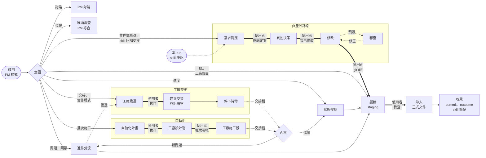

# orchestrator-pm

<details>
<summary>目錄</summary>

- [關於本技能](#關於本技能)
- [如何啟用](#如何啟用)
- [工作區結構](#工作區結構)
- [技能邏輯](#技能邏輯)
- [關鍵參數](#關鍵參數)

</details>

## 關於本技能

`orchestrator-pm` 是專案的控制面 PM。它維持專案的長期方向與狀態、協調有界的調查、整理事實與決策，並在人工核可後準備交接給工廠，但自己不成為實作者。它只管專案層級的方向、範圍、排程與狀態，工廠粒度的研究、設計與實作問題交給工廠。

它只寫 `.manager/**`，例外有三種：人工核可的工廠交接、委派時交進工廠 run 的交接檔與 peer 協作檔，以及非產品路線下對受管對象的文字修改。peer 訊息是溝通管道，不算寫入文件。除此之外不碰產品原始碼、規格或部署狀態。受管對象不是程式（例如 skill 包、文件集）時走非產品路線，由 manager session 直接修改，步驟見下方「非產品路線」。路線由章程或 library 決策宣告，否則由使用者指示並記入 `_run.md`。

PM 與工廠之間保留人工檢查點：PM 只提出候選並準備交接，預設由人另起工廠 session。工廠可選擇性唯讀查閱 `.manager`，但不寫入；回流只經工廠 run 根目錄的 `handoff-manager-<主題>.md`，PM 在人指示或收到 peer 通知時讀取，篩選後擬稿到 run 的 `staging/`，使用者檢查後才沖入正式文件。流程中依主題載入相依子技能：`pm-status-review`（狀態盤點）、`pm-intake-triage`（進件分流）、`pm-investigation-worker`（唯讀調查）、`pm-factory-handoff`（工廠交接）。工作涉及改 skill、製作 skill 或追蹤 skill 品質時依 `skill-feedback-notes` 記錄；本身在修訂 skill 的 run 直接把筆記併入需求對照，其他 run 在收尾時寫 `handoff-skill-<topic>.md`。

PM 發動的委派預設使用 `peer-agent-coordination`，使用者核可委派即視為啟用；討論室建在工廠 run，預設委派同平台 agent；工廠自行唯讀查閱 `.manager`，不發訊息向 PM 提問。PM 在討論室保持可被喚醒直到使用者結束討論室，是否需要背景接聽依 peer §5。補交事項給進行中的工廠 run 時，自動化時直接用討論室；非自動化時先與使用者討論，交接檔草稿放 manager run 根目錄，確認後才交付到工廠 run。其他情況不主動啟用，使用者提及或協作討論需要時才用。使用者核可自動化計畫時，PM 以一個 manager run 管理一整批工廠 run，同一個工廠 session 先把全部 change 開完並審查，使用者一次確認後才依序施工；人工 E2E、sync/archive 在整批結束後一起做，push 一律要使用者另外授權。

## 如何啟用

以斜線指令明確啟用，不會從一般專案問題自動進入：

```text
/orchestrator-pm
```

啟用後的動作：

1. 宣告 PM 模式與這次的目標。
2. 唯讀檢視 `.manager/`。
3. 若 `.manager/` 不存在，先判斷工作區是否已有可觀的專案狀態：
   - **已有狀態**：先徵得同意，同意後先初始化 `.manager/` 並建立 run，再透過 `pm-status-review` 派唯讀 worker 跑 baseline crawl，產出首份 `_status.md` 與 `_milestones.md`，據此討論憲章。
   - **無可爬狀態**：先討論專案憲章與控制邊界，略過 baseline crawl。
4. 若恢復具名的 run，先讀它的 `_run.md`，只讀它指向的產物；沒有指名時不從多個進行中的 run 猜測，必要時詢問。

初始化只用正典檔範本直接建立，不經 `staging/`；baseline crawl 產出的首份狀態仍先擬稿。

## 工作區結構

`.manager/` 區分兩層：工作區追蹤的**正典狀態**，以及本地、非正典的**執行工作區**。

```text
.manager/
├── _charter.md      # 專案憲章與控制邊界
├── _status.md       # 專案狀態，狀態盤點或使用者要求時更新
├── _milestones.md   # 里程碑與功能進度台帳，僅在狀態盤點時更新
├── _backlog.md      # 待辦
├── _library/        # 已確立的事實與決策，附來源、範圍、日期、信心
├── _runs/           # 執行工作區與證據，非正典
│   └── <YYYY-MM-DD>-<slug>/
│       ├── _run.md                       # run 狀態，換手時第一個讀
│       ├── inputs/                       # 原始需求或交接（選用）
│       ├── findings/                     # worker 產物
│       ├── staging/                      # 正典檔的待沖入稿，使用者檢查後才沖入（選用）
│       ├── requirements-comparison.md    # 非產品路線的需求對照（選用）
│       ├── changes/                      # 非產品路線的異動決策與索引（選用）
│       ├── reviews/                      # 審查報告與 PM 裁定（選用）
│       ├── handoff-factory-<topic>.md    # 交付前的交接草稿（選用）
│       ├── skill-notes.md                # skill 回饋筆記（選用）
│       ├── handoff-skill-<topic>.md      # skill 回饋交接（選用）
│       ├── _automation.md                # 自動化計畫（選用）
│       └── outcome.md                    # run 結論
└── .gitignore       # 單行：_runs/
```

正典檔的更新一律先擬稿到 run 的 `staging/`，使用者主動要求的盤點與第一次盤點也一樣。

技能套件本身另附範本與規範，供 PM 依主題取用：

```text
orchestrator-pm/
├── SKILL.md         # 技能主檔
├── assets/          # 正典狀態檔的初始範本，以及 run、異動決策、需求對照、審查彙整、自動化計畫的範本
└── references/      # 工作區契約、狀態模型、權限與人閘、非產品路線等規範
```

## 技能邏輯

實線是主流程，虛線是可選或例外流程，粗箭頭是人閘，必須停下等使用者，綠燈的檢查不等於可以出貨。


```mermaid
%%{init: {"flowchart": {"rankSpacing": 35, "nodeSpacing": 22}}}%%
flowchart LR
  E1([啟用<br/>PM 模式]) --> RQ{意圖}

  RQ -->|討論| DI[PM 討論]
  RQ -->|蒐證| IW[唯讀調查<br/>PM 綜合]
  RQ -->|進度| SR[狀態盤點]
  RQ -->|問題、回饋| TR[進件分流]
  RQ -->|交接、<br/>實作程式| FC
  RQ -->|批次施工| AU
  RQ -->|非程式修改、<br/>skill 回饋交接| N1
  RQ -->|撿走<br/>工廠條目| SG
  TR -.->|候選| FC

  subgraph G1["工廠交接"]
    FC[工廠候選] ==>|使用者<br/>核可| FH[建立交接<br/>與討論室]
    FH --> FW[停下待命]
  end

  subgraph G2["自動化"]
    AU[自動化計畫] ==>|使用者<br/>核可| AD[工廠設計段]
    AD ==>|使用者<br/>批次檢視| AB[工廠施工段]
  end

  FW -.->|交接檔| FR{內容}
  AB -.->|交接檔| FR
  FR -->|進度| SR
  FR -->|新問題| TR

  subgraph G3["非產品路線"]
    N1[需求對照] ==>|使用者<br/>逐輪定案| N2[異動決策]
    N2 ==>|使用者<br/>指示修改| N3[修改]
    N3 -.->|預設| N4[審查]
    N4 -.->|修正| N3
  end
  SKN([本 run<br/>skill 筆記]) -.-> N1
  N3 ==>|使用者<br/>git diff| SG

  SR --> SG[擬稿<br/>staging]
  TR --> SG
  SG ==>|使用者<br/>檢查| CF[沖入<br/>正式文件]
  CF --> CL[收尾<br/>commit、outcome<br/>skill 筆記]
```

### 請求路由

PM 依使用者意圖決定載入哪個子技能，只有需要長期紀錄或證據時才建立 run。

### 非產品路線

受管對象不是程式時，manager 直接修改，步驟詳見 `references/non-product-route.md`。需求對照與審查是預設步驟：單一目標且需求明確時可省略需求對照；使用者說不做或只改措辭時可省略審查。

審查中發現原範圍外的必要修改，追加異動決策；被取代的設計在舊異動決策加註，不改寫。已定方向內的低嚴重度措辭修正可不再複查，記在審查彙整。

### 工廠交接

PM 提候選、等人核可、建自足交接。PM 發動的委派會在工廠 run 建 peer 討論室。非自動化時建好交接即停下，由人另起工廠 session。工廠在每個 run 到達等待使用者檢查時留下交接檔，PM 在人指示或收到 peer 通知時讀取，交給狀態盤點篩選並擬稿；其中的新問題或候選才進入進件分流。

### 自動化

使用者核可後才執行，PM 不自行啟動。

計畫只預先授權兩項：使用者一次檢視全部 change 後，依序派工（含 Check 與 agent E2E 驗證）不再逐 run 確認；以及每個 run 預設 commit 一次，使用者可改或關閉。檢視 change、人工 E2E、sync/archive、push 都不能預先授權。某個 run 停下時，只暫停依賴它的 run。

## 關鍵參數

### PM 狀態彙整

聊天中保持精簡，耐久細節留在 manager run。欄位如下：

| 欄位 | 意義 |
| --- | --- |
| mode | discuss／status-review／triage／investigation／handoff／automation／non-product-edit |
| run_dir | 目前 run 路徑，或 none |
| project_state | 專案狀態摘要 |
| milestone_progress | 里程碑進度摘要，或 none |
| active_cases | 進行中案件數與摘要 |
| factory_candidates | 工廠候選數與摘要 |
| decisions_needed | 至多三項待決，或 none |
| next_human_checkpoint | 下一個人工檢查點，或 none |

### 正典狀態與執行記憶

| 分類 | 檔案 | 性質 |
| --- | --- | --- |
| 正典狀態 | `_charter.md`、`_status.md`、`_milestones.md`、`_backlog.md`、`_library/**` | 專案的權威真相；更新一律先擬稿到 `staging/`。`_status.md` 在狀態盤點或使用者要求時更新，`_milestones.md` 只在狀態盤點時更新 |
| 執行記憶 | `.manager/_runs/<run>/**` | 工作記憶與證據，非專案真相 |

工作者結論絕不直接更新正典狀態，須由 PM session 比對、綜合後才升級。遇到方向重大歧義、PM 判定與人工驗收衝突、候選可交接、自動化計畫待核可、需寫入 `.manager/**` 以外、或調查需變動產品倉庫時，一律停下等待人工。非產品路線對受管對象的修改不在此限，改為修改前需使用者指示，修改後由使用者以 git diff 或等效的前後對照審查。
