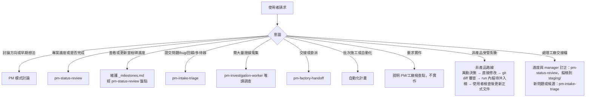
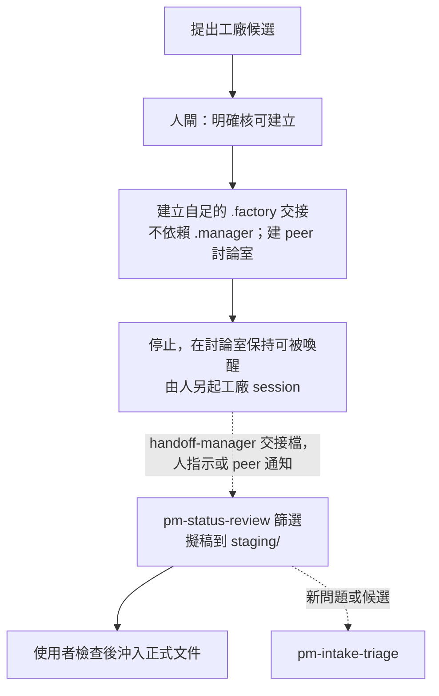
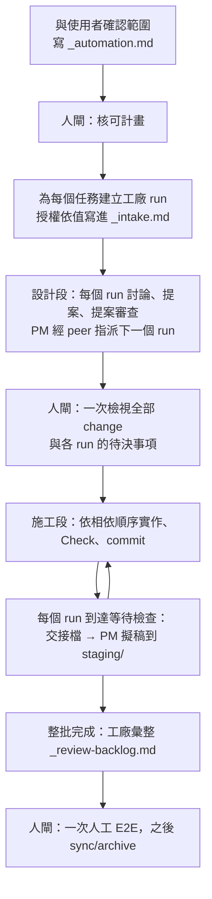

# orchestrator-pm

<details>
<summary>目錄</summary>

- [關於本技能](#關於本技能)
- [如何啟用](#如何啟用)
- [工作區結構](#工作區結構)
- [技能邏輯](#技能邏輯)
- [關鍵參數](#關鍵參數)

</details>

## 關於本技能

`orchestrator-pm` 是專案的控制面 PM。它維持專案的長期方向與狀態、協調有界的調查、整理事實與決策，並在人工核可後準備交接給工廠，但自己不成為實作者。它只管專案層級的方向、範圍、排程與狀態，工廠粒度的研究、設計與實作問題交給工廠。

它只寫 `.manager/**`，例外有三種：人工核可的工廠交接、交進工廠 run 的交接檔，以及非產品路線下對受管對象的文字修改。peer 訊息是溝通管道，不算寫入文件。除此之外不碰產品原始碼、規格或部署狀態。受管對象不是程式（例如 skill 包、文件集）時走非產品路線：先在 run 內寫異動決策，由 manager session 直接修改，使用者以 git diff 審查，受管對象未納入版本控制時改用等效的前後對照；之後先在 run 內擬 manager 待沖入稿，經使用者檢查後才更新正式文件，狀態與里程碑一律經 `pm-status-review` 更新。

PM 與工廠之間保留人工檢查點：PM 只提出候選並準備交接，預設由人另起工廠 session。工廠可選擇性唯讀查閱 `.manager`，但不寫入；回流只經工廠 run 根目錄的 `handoff-manager-<主題>.md`，PM 在人指示或收到 peer 通知時讀取，篩選後擬稿到 run 的 `staging/`，使用者檢查後才沖入正式文件。流程中依主題載入相依子技能：`pm-status-review`（狀態盤點）、`pm-intake-triage`（進件分流）、`pm-investigation-worker`（唯讀調查）、`pm-factory-handoff`（工廠交接）。

PM 發動的委派預設使用 `peer-agent-coordination`，使用者核可委派即視為啟用；討論室建在工廠 run，預設委派同平台 agent；工廠自行唯讀查閱 `.manager`，不發訊息向 PM 提問。PM 在討論室保持可被喚醒直到使用者結束討論室，同平台內建訊息不需背景接聽。其他情況不主動啟用，使用者提及或協作討論需要時才用。使用者核可自動化計畫時，PM 以一個 manager run 管理一整批工廠 run，同一個工廠 session 先把全部 change 開完並審查，使用者一次確認後才依序施工；人工 E2E、sync/archive 在整批結束後一起做，push 一律要使用者另外授權。

## 如何啟用

以斜線指令明確啟用，不會從一般專案問題自動進入：

```text
/orchestrator-pm
```

啟用後的動作：

1. 宣告 PM 模式與這次的目標。
2. 唯讀檢視 `.manager/`。
3. 若 `.manager/` 不存在，先判斷工作區是否已有可觀的專案狀態：
   - **已有狀態**：先徵得同意，同意後先初始化 `.manager/` 並建立 run，再透過 `pm-status-review` 派唯讀 worker 跑 baseline crawl，產出首份 `_status.md` 與 `_milestones.md`，據此討論憲章。
   - **無可爬狀態**：先討論專案憲章與控制邊界，略過 baseline crawl。
4. 若恢復具名的 run，先讀它的 `_run.md`，只讀它指向的產物。

## 工作區結構

`.manager/` 區分兩層：工作區追蹤的**正典狀態**，以及本地、非正典的**執行工作區**。

```text
.manager/
├── _charter.md      # 專案憲章與控制邊界
├── _status.md       # 專案狀態，僅在狀態盤點時更新
├── _milestones.md   # 里程碑與功能進度台帳，僅在狀態盤點時更新
├── _backlog.md      # 待辦
├── _library/        # 已確立的事實與決策，附來源、範圍、日期、信心
├── _runs/           # 執行工作區與證據，非正典
│   └── <YYYY-MM-DD>-<slug>/
│       ├── staging/        # 正典檔的待沖入稿，使用者檢查後才沖入（選用）
│       └── _automation.md  # 自動化計畫（選用）
└── .gitignore       # 單行：_runs/
```

正典檔的更新一律先擬稿到 run 的 `staging/`，使用者主動要求的盤點與第一次盤點也一樣。

技能套件本身另附範本與規範，供 PM 依主題取用：

```text
orchestrator-pm/
├── SKILL.md         # 技能主檔
├── assets/          # 正典狀態檔的初始範本
└── references/      # 工作區契約、狀態模型、權限與人閘等規範
```

## 技能邏輯

### 請求路由

PM 依使用者意圖決定載入哪個子技能，只有需要長期紀錄或證據時才建立 run。


```mermaid
flowchart TD
  U[使用者請求] --> R{意圖}
  R -- 討論方向或早期想法 --> D[PM 模式討論]
  R -- 專案進度或是否完成 --> S[pm-status-review]
  R -- 查看或更新里程碑進度 --> M[維護 _milestones.md<br/>經 pm-status-review 盤點]
  R -- 提交問題/bug/回饋/多待辦 --> T[pm-intake-triage]
  R -- 需大量證據蒐集 --> I[pm-investigation-worker 唯讀調查]
  R -- 交接或委派 --> H[pm-factory-handoff]
  R -- 批次施工或自動化 --> A[自動化計畫]
  R -- 要求實作 --> X[說明 PM/工廠檢查點，不實作]
  R -- 非產品受管對象 --> N[非產品路線<br/>異動決策 → 直接修改 → git diff 審查 → run 內擬待沖入稿 → 使用者檢查後更新正式文件]
  R -- 處理工廠交接檔 --> F[進度與 manager 訂正：pm-status-review，擬稿到 staging/<br/>新問題或候選：pm-intake-triage]
```

### 工廠交接

PM 提候選、等人核可、建自足交接。PM 發動的委派會在工廠 run 建 peer 討論室。非自動化時建好交接即停下，由人另起工廠 session。工廠在每個 run 到達等待使用者檢查時留下交接檔，PM 在人指示或收到 peer 通知時讀取，交給狀態盤點篩選並擬稿；其中的新問題或候選才進入進件分流。


```mermaid
flowchart TD
  A[提出工廠候選] --> B[人閘：明確核可建立]
  B --> C[建立自足的 .factory 交接<br/>不依賴 .manager；建 peer 討論室]
  C --> D[停止，在討論室保持可被喚醒<br/>由人另起工廠 session]
  D -. handoff-manager 交接檔，人指示或 peer 通知 .-> E[pm-status-review 篩選<br/>擬稿到 staging/]
  E --> G[使用者檢查後沖入正式文件]
  E -. 新問題或候選 .-> T[pm-intake-triage]
```

### 自動化

使用者核可後才執行，PM 不自行啟動。


```mermaid
flowchart TD
  A[與使用者確認範圍<br/>寫 _automation.md] --> B[人閘：核可計畫]
  B --> C[為每個任務建立工廠 run<br/>授權依值寫進 _intake.md]
  C --> D[設計段：每個 run 討論、提案、提案審查<br/>PM 經 peer 指派下一個 run]
  D --> R[人閘：一次檢視全部 change<br/>與各 run 的待決事項]
  R --> E[施工段：依相依順序實作、Check、commit]
  E --> H[每個 run 到達等待檢查：<br/>交接檔 → PM 擬稿到 staging/]
  H --> E
  H --> F[整批完成：工廠彙整 _review-backlog.md]
  F --> G[人閘：一次人工 E2E，之後 sync/archive]
```

計畫只預先授權兩項：使用者一次檢視全部 change 後，依序派工不再逐 run 確認；以及每個 run 預設 commit 一次，使用者可改或關閉。檢視 change、人工 E2E、sync/archive、push 都不能預先授權。某個 run 停下時，只暫停依賴它的 run。

## 關鍵參數

### PM 狀態彙整

聊天中保持精簡，耐久細節留在 manager run。欄位如下：

| 欄位 | 意義 |
| --- | --- |
| mode | discuss／status-review／triage／investigation／handoff／automation／non-product-edit |
| run_dir | 目前 run 路徑，或 none |
| project_state | 專案狀態摘要 |
| milestone_progress | 里程碑進度摘要，或 none |
| active_cases | 進行中案件數與摘要 |
| factory_candidates | 工廠候選數與摘要 |
| decisions_needed | 至多三項待決，或 none |
| next_human_checkpoint | 下一個人工檢查點，或 none |

### 正典狀態與執行記憶

| 分類 | 檔案 | 性質 |
| --- | --- | --- |
| 正典狀態 | `_charter.md`、`_status.md`、`_milestones.md`、`_backlog.md`、`_library/**` | 專案的權威真相；其中 `_status.md` 與 `_milestones.md` 只在狀態盤點時更新 |
| 執行記憶 | `.manager/_runs/<run>/**` | 工作記憶與證據，非專案真相 |

工作者結論絕不直接更新正典狀態，須由 PM session 比對、綜合後才升級。遇到方向重大歧義、PM 判定與人工驗收衝突、候選可交接、自動化計畫待核可、需寫入 `.manager/**` 以外、或調查需變動產品倉庫時，一律停下等待人工。非產品路線對受管對象的修改不在此限，檢查點是使用者以 git diff 或等效的前後對照審查。
